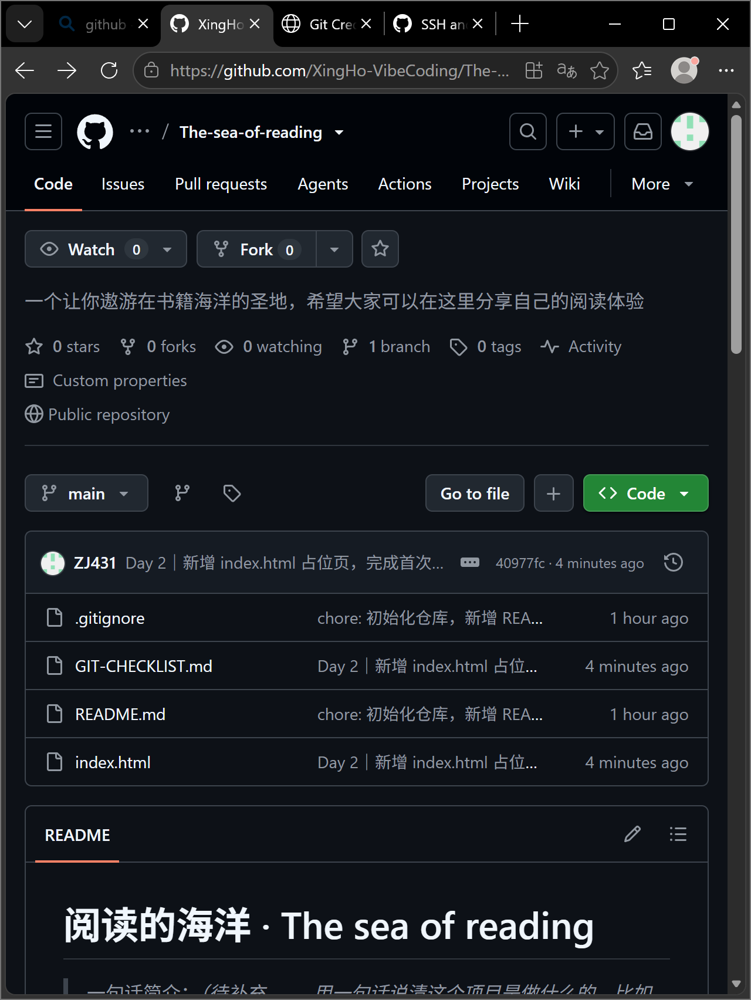

# Day 2 打卡日志 · 仓库创建与首次提交

| | |
| --- | --- |
| **日期** | 2026-09-19 |
| **周次** | 第 1 周 |
| **主题** | 仓库创建与首次提交 |
| **状态** | ✅ 全部完成 |
| **当日提交** | `40977fc` |

---

## 一、今日板块

- [x] **① Git 与 GitHub 概念** —— 分清「本地存档」和「云端托管」是两件事
- [x] **② 仓库创建与首次提交**（AI 代办）

**概念小结**：Git 是装在自己电脑上的版本控制工具，负责给每次改动编号存档，不联网也能用；GitHub 是云端的代码托管平台，负责保管和展示。「把项目存进 GitHub」其实是两件事——先用 Git 在本地存档，再 `push` 推上云端。

本地有三个阶段，改动依次流过：

| 阶段 | 命令 | 干什么 |
| --- | --- | --- |
| 工作区 | —— | 你实际编辑文件的地方 |
| 暂存区 | `git add` | 挑出这次要提交的改动 |
| 本地仓库 | `git commit` | 存档并编号（生成哈希） |

存档完成后再 `git push` 送到 GitHub。反向操作是 `git pull`，把云端内容取回本地。

---

## 二、主任务

- [x] 完成 GitHub 仓库
- [x] 完成第一次提交
- [x] AI 生成 `index.html` 占位页并上线

---

## 三、完成标准

- [x] GitHub 网页能看到仓库
- [x] GitHub 网页能看到 `index.html`
- [x] 忽略文件生效，`.env` 不会被上传

`.env` 是以后存数据库配置的本地文件，**第 23 天才会真正用到**。今天只要确保忽略规则里有它。

**没有只读规则就下结论，而是真造文件实测了一遍**：

```
$ git check-ignore -v .env secrets.json app.db
.env          -> .gitignore:10:*.env
secrets.json  -> .gitignore:13:*secret*
app.db        -> .gitignore:61:*.db
```

三个文件在 `git status` 里**完全不可见**，`git add -A` 也不会误收。测试完已删除，没有残留在仓库里。

`.gitignore` 中 `.env` 相关规则：

```
.env
.env.*
!.env.example
*.env
```

> 为什么必须实测：**规则写了不等于生效**。`*secret*` 这种通配符到底能匹配什么，只有真拿文件去撞一次才敢确认。

---

## 四、今日交付物

- [x] **截图** —— 见下方
- [x] **改动文件清单 + 归属任务** —— 见第五节
- [x] **提交并推送** —— `40977fc`

### 截图：GitHub 仓库首页



图中三样硬性要求都已拍到：仓库名 `The-sea-of-reading`、文件名 `index.html`、以「Day 2｜」开头的提交记录 `40977fc`。

---

## 五、改动文件清单与归属

| 文件 | 变动 | 归属任务 |
| --- | --- | --- |
| `index.html` | 新增（7253 字节） | **Day 2** 主任务 |
| `README.md` | 修改（填掉全部占位文字） | **Day 2** 收尾 |
| `journal/Day-02.md` | 新增 | **Day 2** 打卡日志 |
| `journal/assets/Day-02-repo-home.png` | 新增 | **Day 2** 截图存档 |
| `GIT-CHECKLIST.md` | 修改（表格排版被编辑器自动重排） | Day 1 遗留，随 Day 2 首次提交一并入库 |
| `.gitignore` | 本次未改动 | Day 1 |

---

## 六、今日思考题

> **第一次把项目存进 GitHub 时，你最担心哪一步出错？为什么？**

我最担心的**不是「推不上去」，而是「推上去了不该推的东西」**。

推不上去是**看得见**的失败——会报错、会卡住，我立刻就知道有问题，然后去查。但敏感文件泄漏是**看不见**的失败：`.env`、密钥、数据库会安安静静躺在仓库里，可能几个月后才发现。

而且这个仓库现在是 **public**，一旦推上去，即使事后删掉文件，Git 的历史记录里仍然留有痕迹，别人也可能早就缓存了。

所以今天最该较真的地方不是 `git push` 能不能成功，而是 `.gitignore` 到底管不管用。这也是为什么我没有「看一眼规则里有 `.env` 就完事」，而是造了一个假的 `.env` 出来真撞一次。

---

## 七、余力加练：本地怎么回退到刚才的版本

按撤销力度从小到大，四档：

**① 只撤掉还没提交的改动**

```bash
git status                     # 先看哪些文件被改了
git restore index.html         # 恢复成上次提交的样子
```

⚠️ **不可逆**，没提交的改动直接消失。

**② 只看旧版本长什么样，不动任何东西**（最安全，建议先玩这个）

```bash
git show 40977fc:index.html    # 把当时那一版打印出来看
```

**③ 撤销一次已经推上去的提交**（正规做法）

```bash
git revert 40977fc             # 新建一个「反向提交」抵消它，历史完整保留
git push
```

注意：它是**新增一个提交**来抵消，不是抹掉历史。已经推上去的提交只能用这招。

**④ 让整个项目倒退回某个时间点**

```bash
git reset --soft 40977fc       # 改动留在暂存区
git reset --mixed 40977fc      # 改动留在工作区（默认）
git reset --hard 40977fc       # ⚠️ 改动全部永久丢弃
```

⚠️ **已经 push 过就别用 `reset --hard` + 强推**，那会改写别人的历史，是团队协作里的红线。本地自己玩没事。

---

## 八、今日卡点与解法

**卡点 1：`logs/` 目录被 `.gitignore` 挡住了**

本来打算把打卡日志放在 `logs/` 目录，结果 `git check-ignore` 显示它命中 `.gitignore` 第 101 行的 `logs/` 规则（那一条是防运行时日志的，属于标准防护，不能改）。

**解法**：换个不冲突的目录名 `journal/`，把防护规则原样保留。

**教训**：新建目录前先跑一次 `git check-ignore -v <路径>`，别等提交时才发现文件进不去。

**卡点 2**：GitHub 界面里提交标题的 `｜`（全角竖线）显示成细瘦的 `|`。这是 GitHub 的字体渲染，不是打错了，不用去改标题。

**未踩的坑**：GitHub 注册受阻（降级方案）没有触发，一切顺利。

---

## 九、日常命令备忘

```bash
git status                     # 看现在什么状态（最常用）
git add .                      # 把改动放进暂存区
git commit -m "Day N｜说明"      # 存档
git push                       # 送到 GitHub
git pull                       # 从 GitHub 取回
git log --oneline              # 看历史提交
```

---

## 十、明日待办

- [x] ~~README 补齐项目说明~~ —— 已于今日完成
- [ ] 开始 Day 3 任务
- [ ] 后续新增目录前，先 `git check-ignore -v` 确认不会被忽略规则误伤

---

*本日志由 AI 协助整理，内容基于当日实际操作记录。*
