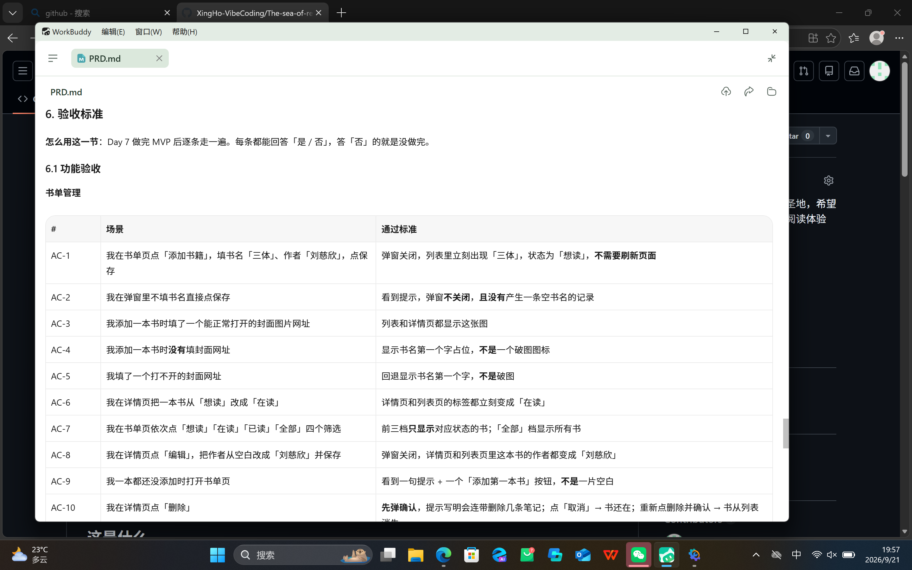
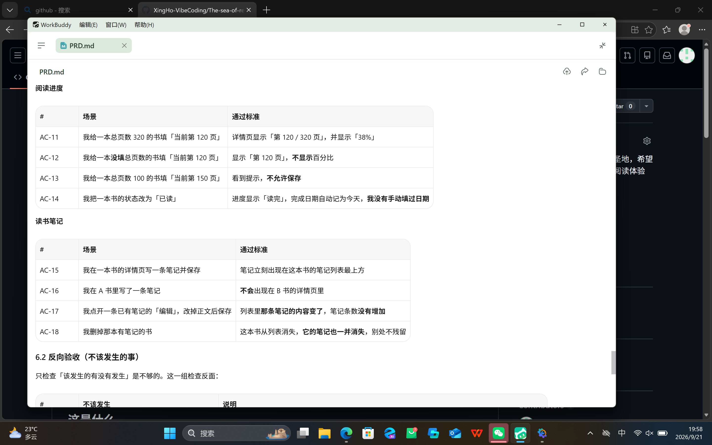
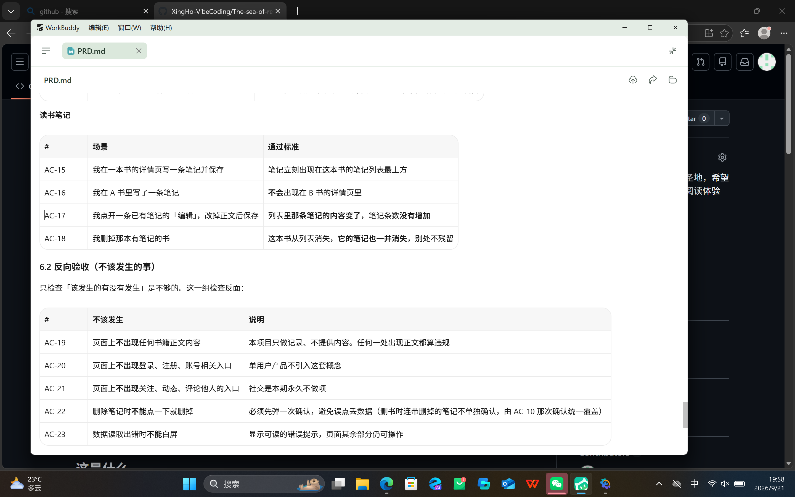
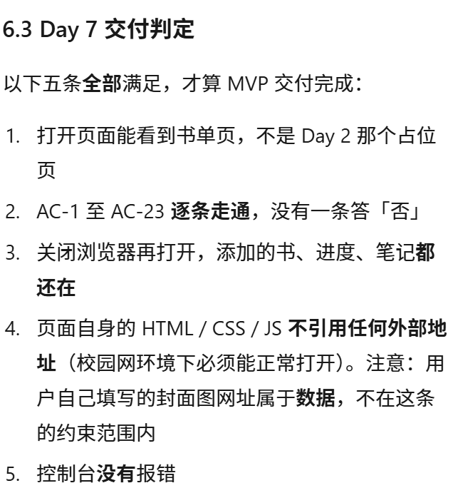

# Day 4 打卡日志 · 写 PRD

| | |
| --- | --- |
| **日期** | 2026-09-21 |
| **周次** | 第 1 周 |
| **主题** | 写 PRD（产品需求文档） |
| **状态** | ✅ 全部完成 |
| **当日提交** | ⏳ 待推送 |

---

## 一、今日板块

- [x] **① PRD 结构讲解** —— 六节骨架，每节回答什么问题
- [x] **② 撰写 PRD** —— `docs/PRD.md`，359 行
- [x] **③ AI 自检** —— 按固定清单逐条验收，挑出 4 个「必须修改」级问题并全部修掉

**五步工作流小结**（今天走的是第 ② 步）：

| 步 | 干什么 | 产出 | 时间 |
| --- | --- | --- | --- |
| ① 研究需求 | 搞清楚给谁用、解决什么真问题、值不值得做 | `research.md` | Day 3 ✅ |
| ② 写 PRD | 把模糊需求翻译成精确规格 | `PRD.md` | **今天** |
| ③ 技术设计 | 用什么技术、数据存哪、怎么跑起来 | 技术方案 | Day 5–6 |
| ④ 保存项目规则 | 把 AI 必须守的规矩写成文件固化 | `AGENTS.md` | 已完成 |
| ⑤ 小步开发和迭代 | 一次只做一小块，跑通再往下 | 能跑的代码 | Day 7 起 |

**PRD 六节骨架**（每节回答一个问题）：

| 节 | 回答什么 | 少了它会怎样 |
| --- | --- | --- |
| 1 依据与范围 | 这些决定从哪来 / 本文档管什么 | 每个功能都变成无来由的断言，将来无法反驳也无法维护 |
| 2 目标用户与问题 | 给谁用、解决什么 | 范围会失控——因为不知道为谁做，就什么都可以加 |
| 3 MVP 功能 | 用户动作、可观察结果、边界、异常 | 写代码时靠猜，「做完了」没有标准 |
| 4 页面与字段 | 看得见什么、数据长什么样 | 实现时会自己发明字段名，你对不上号 |
| 5 本期不做 | 边界在哪、以后做什么 | 做到一半范围偷偷长大 |
| 6 验收标准 | 什么算做对了 | 无法判断交付完成，只能靠「感觉差不多了」 |

---

## 二、主任务

- [x] 完成 `docs/PRD.md`
- [x] 含验收标准 —— 共 **23 条**（AC-1~18 功能验收 + AC-19~23 反向验收）
- [x] 让 AI 按验收标准自检一次 —— 挑出 4 个「必须修改」级问题，全部修掉后复检通过

**三个功能，每个都按统一四段写**（用户动作 → 可观察结果 → 边界 → 异常处理）：

| 功能 | 核心承诺 |
| --- | --- |
| 书单管理 | 增删改书、三态切换、状态筛选；删书时笔记一并消失（先确认） |
| 阅读进度 | 填了总页数显示「第 120 / 320 页（38%）」；没填就只显示页数，**不瞎算百分比** |
| 读书笔记 | 按书归档、最新在上、能编辑、取消不丢原内容、删除要二次确认 |

**三个关键决定**（我拍板时选的，记录在此）：

1. **只给自己用** —— 无登录、无注册、无账号。代价：别人打开网址会看到同一份数据，本期接受
2. **状态只做三态**（想读 / 在读 / 已读）—— 不加 StoryGraph 的「弃读 DNF」，那是好设计但会拖慢 MVP
3. **不存进度百分比** —— 由「当前页 ÷ 总页数」实时算（派生值）。存了反而容易和页数对不上

---

## 三、完成标准

- [x] `PRD.md` 已入库 —— `docs/PRD.md`，359 行 / 21448 字节
- [x] 含验收标准 —— 23 条，每条都能回答「是 / 否」
- [x] AI 自检挑不出「必须修改」级问题 —— 第一轮挑出 4 个、修完，第二轮复检通过（明细见第八节）

---

## 四、今日交付物

- [x] **`docs/PRD.md`** —— 本日主产出
- [x] **截图** —— 四张，见下方
- [x] **改动文件清单 + 归属任务** —— 见第五节
- [ ] **提交并推送** —— ⏳ 待推送

### 截图：`docs/PRD.md` 的验收标准段

验收标准太长，一屏拍不全，用四张接力覆盖 **AC-1 至 AC-23** 加 6.3 交付判定。第 2、3 张在「读书笔记」表上有重叠，正好互相印证编号不断档。

**截图一** —— `6. 验收标准` 标题 + `6.1 功能验收` 的「书单管理」表，**AC-1 ~ AC-10**。

**截图二** —— 「阅读进度」表 **AC-11 ~ AC-14** + 「读书笔记」表 **AC-15 ~ AC-18**，下接 `6.2 反向验收` 标题。

**截图三** —— `6.2 反向验收` 完整表，**AC-19 ~ AC-23**（「不该发生的事」五条）。

**截图四** —— `6.3 Day 7 交付判定` 五条，第 2 条写着「**AC-1 至 AC-23 逐条走通，没有一条答『否』**」——前面三张与它首尾对得上。

---

## 五、改动文件清单与归属

| 文件 | 变动 | 归属任务 |
| --- | --- | --- |
| `docs/PRD.md` | 新增（359 行 / 21448 字节） | **Day 4** 主任务 |
| `journal/Day-04.md` | 新增 | **Day 4** 打卡日志 |
| `docs/research.md` | 修改（6.1 本期范围由四个模块收敛为三个，三处同步，+14 −4） | **Day 4** 收尾（口径一致） |
| `README.md` | 修改（功能段拆为「本期做 / 计划后续 / 本期不做」三层，+13 −4） | **Day 4** 收尾（口径一致） |
| `journal/assets/Day-04-PRD-acceptance-1~4.png` | 新增（截图存档，四张） | **Day 4** 交付物 |
| `.gitignore` / `index.html` / `GIT-CHECKLIST.md` | 本次未改动 | Day 1 / Day 2 |
| `journal/Day-02.md` / `Day-03.md` | 本次未改动 | Day 2 / Day 3 |

---

## 六、今日思考题

> **你在 PRD 里砍掉了什么功能？为什么砍它？**

今天砍了**两刀**——一刀是主动砍的，一刀是自检时才发现该砍的。

### 第一刀：阅读统计（主动砍）

`docs/research.md` 的 6.1 原本把**阅读统计**列在本期四个模块里，我也确认过。写 PRD 时把它移出去了。

**为什么砍它**：

1. **它依赖前三个模块先产出数据。** Day 7 就做，打开看到的只会是一张空表和一条平线——**即使做错了也看不出来**。一个测不出对错的模块，做了等于没做
2. **统计的价值靠时间积累。** The StoryGraph 是运行很久之后，统计才成为它的招牌能力，不是第一天就有的
3. **Day 7 的页面从四个降到三个**，学习节奏更稳

这一刀不只是"少做一个功能"，它还**反过来改了上游文档**——`research.md` 6.1 和 `README.md` 的功能列表都同步说明了「阅读统计移入计划后续」。**三份文档现在口径一致**。

> 💡 顺带一个观察：**在 PRD 阶段推翻研究结论是完全正常的**。这正是五步工作流里「每一步都能回头修正上一步」的含义——不是前面写错了，是后面的视角更具体了。

### 第二刀：书籍评分（自检时才发现）

这一刀更有意思。PRD 第一版的字段表里有一个 `rating` 字段（1–5 星评分），还写着「只有已读的书才显示录入入口」。看起来很正常——豆瓣的核心不就是星级吗？

**但自检时发现：三个 MVP 功能里，没有任何一个包含评分；23 条验收标准里，也没有一条测它。**

也就是说，我在字段表里规定了「页面上要有一个评分入口」，却没有任何一节说清「用户什么场景下会去点它、点了之后该看到什么」。**这是一个永远没人录入、也永远验不了的字段。**

**处理**：从字段表移除，写进第 5.1 节「计划后续」，理由写明。没有删掉了事——它是个好功能，只是不属于本期。

**这一刀教会我的**：`PRD` 的"砍"不只是砍功能，也包括**砍掉自己顺手写下的、没想清楚的东西**。字段表比功能章节更容易夹带私货——因为写功能时你会想"用户要干什么"，写字段时容易变成"这个数据好像该有"。

---

## 七、余力加练：把一项功能写成用户故事

原题：**让 AI 把一项功能写成用户故事。**

选中的功能是**读书笔记**——它对应三个问题里的第 2 条「读完了没留下痕迹」，也是"数据属于你自己"最直接的体现。

### 用户故事

> **作为一个下班后只能读十几页、读完就忘的人，**
> **我想要在每本书旁边随手记下当时的想法，**
> **以便半年后翻到这本书时，还能看见当时的自己在想什么。**

### 这三句话分别在干什么

| 部分 | 内容 | 作用 |
| --- | --- | --- |
| **角色** | 下班后只能读十几页、读完就忘的人 | 角色越具体，后面能砍的东西越多。写成「用户」，你就不知道要不要做夜间模式、要不要做阅读打卡 |
| **能力** | 在每本书旁边随手记下当时的想法 | 一句话一个能力。「随手」两个字定了调——**不能为了写笔记跳三层页面** |
| **价值** | 半年后还能看见当时的自己 | 这是**最容易被写坏的一句**。它的作用不是装饰，是**判断标准**——半年后还能不能看见？不能，说明功能没做成 |

### 一个写坏了的版本（对比用）

> ❌ **作为一个用户，我想要一个笔记功能，以便记录笔记。**

三处都坏了：角色是「用户」（不知道为谁做）、能力是「笔记功能」（功能名不是能力）、价值是「记录笔记」（和前面同义反复，等于没说）。**照样能写完 PRD，但 Day 7 做出来会发现：能记笔记，但记了没用。**

### 故事 → 验收标准的对应关系

| 故事里的词 | 落到哪条 AC |
| --- | --- |
| 「在每本书旁边」 | AC-16（笔记不会串到别的书） |
| 「随手记下」 | AC-15（保存后立刻出现在列表最上方，不用刷新） |
| 「记下当时的想法」 | AC-17（想改就改，改完不新增一条） |
| （故事没提，但边界必须写） | AC-22（删除要确认）、3.3 边界（空白不许存） |

**注意最后一行**：用户故事天然写得下「正常路径」，写不下「异常路径」。**故事负责说清"为什么做"，验收标准负责说清"什么算做对"**——两者缺一不可。这就是为什么 PRD 里既有功能章节，也要单独有一节验收标准。

---

## 八、今日卡点与解法

**卡点：自检时发现 PRD「正文写了、验收标准里没有」。**

自检第一步不是读一遍，而是**拿第 3 节的用户动作清单去第 6 节的 AC 区逐条比对**。结果：

| 内容 | 正文出现 | AC 区出现 | 判定 |
| --- | --- | --- | --- |
| 「编辑」 | 8 次 | **0 次** | ❌ 明确列出的动作，却没有验收标准 |
| `rating` / 评分 | 有（字段表） | 0 次 | ❌ 定义了却无人录入 |
| 删除书籍 | 有（但是点一下就删） | — | ⚠️ 删笔记要确认，删书（影响更大）反而不要求 |

**四处「必须修改」级问题及修法**：

| # | 问题 | 修法 |
| --- | --- | --- |
| M1 | `rating` 字段定义了却无功能、无 AC | 移出字段表，写进「计划后续」 |
| M2 | 「编辑」正文 8 次、AC 0 次 | 3.3 补上「编辑已有笔记」；新增 AC-8、AC-17 |
| M3 | 删书（连带删 N 条笔记）不要求确认 | 3.1 加确认步骤（提示会删几条）；新增 AC-10 |
| M4 | 交付判定写「无外部 CDN 依赖」，但封面是外部网址 | 改为「页面自身的 HTML / CSS / JS 不引用外部地址」，并注明用户填的封面网址属于**数据** |

**另外顺手改了 3 处**：AC-3 补明「能正常打开的图片网址」、AC-7 从只测「已读」扩为四档全测、字段表「系统」列补上含义说明；并**新增 AC-9**（空状态：一本书都没有时不是一片空白）。

**验收标准 19 条 → 23 条**，编号重排（书单 AC-1~10 / 进度 AC-11~14 / 笔记 AC-15~18 / 反向 AC-19~23），6.3 的引用同步更新。

**教训**：

> **「写了」不等于「能验」。** 判断方法很土但很有效——把功能章节里的每个动作词拎出来，去验收标准里搜一遍。搜不到的，就是 Day 7 会漏掉的地方。

**还有一句实话**：自检是 AI 检查自己写的东西，天生有盲区。这轮挑出来的 4 个都是**结构性问题**（能靠脚本扫出「正文有、AC 没有」这种不对称），但**「这个设计本身合不合理」这类问题扫不出来**——比如「想读状态不显示进度区」是否合理、「允许重复添加同名书」是否可接受，这些只能靠人读的时候判断。

---

## 九、今日学到的

- **PRD 是把「做什么」翻译成「什么算做对」。** 「书单管理」是功能名，「点添加 → 填书名 → 保存后立刻出现在列表里」才是规格。前者谁都能写，后者才管用
- **验收标准要写两遍：该发生的，和不该发生的。** 反向验收（AC-19~23）检查的是边界有没有被越过——「不做社交」光写一句没用，得有一条能验的检查项卡住它
- **用户故事负责"为什么做"，验收标准负责"什么算做对"。** 故事写不下异常路径，所以两者不能互相代替
- **砍功能要连带改上游文档。** 砍掉阅读统计，`research.md` 和 `README.md` 都得跟着改，否则同一个仓库里两份文档自相矛盾
- **写文档时最容易夹带私货的地方是字段表。** 写功能时你会想"用户要干什么"，写字段时容易变成"这个数据好像该有"——评分就是这么混进来的

---

## 十、明日待办

- [x] ~~补 Day 4 截图（`docs/PRD.md` 的验收标准段）~~ —— 四张已归档（2026-09-21 补）
- [ ] 开始 Day 5：技术设计（技术选型，写代码仍是 Day 7 的事）
- [ ] 把 PRD 第 3 节的功能逐条转成用户故事（今天只写了一条作为练习）

---

*本日志由 AI 协助整理，内容基于当日实际操作记录。*
