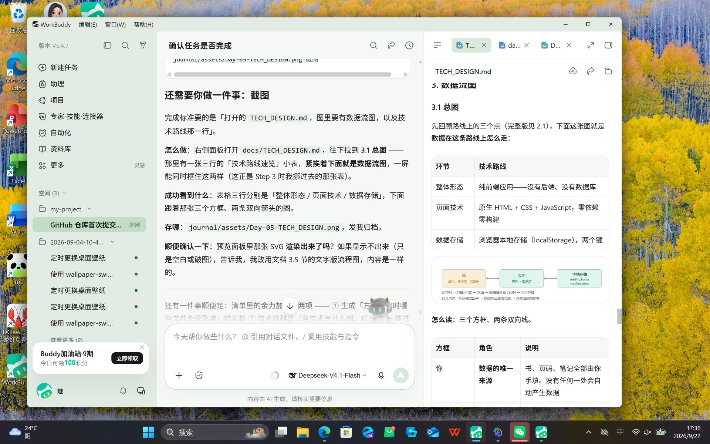

# Day 5 打卡日志 · 技术设计

| | |
| --- | --- |
| **日期** | 2026-09-22 |
| **周次** | 第 1 周 |
| **主题** | 技术设计（技术选型 + 数据流图） |
| **状态** | ✅ 全部完成 |
| **当日提交** | ⏳ 待推送 |

---

## 一、今日板块

- [x] **① 前后端与数据库分工** —— 讲清三个角色，逐条论证本项目为什么不需要后两层
- [x] **② 技术路线生成** —— `docs/TECH_DESIGN.md`，11 小节
- [x] **③ 数据流图** —— `docs/data-flow.svg` + 文档第 3 节

**五步工作流小结**（今天走的是第 ③ 步）：

| 步 | 干什么 | 产出 | 进度 |
| --- | --- | --- | --- |
| ① 研究需求 | 搞清楚给谁用、解决什么真问题、值不值得做 | `research.md` | Day 3 ✅ |
| ② 写 PRD | 把模糊需求翻译成精确规格 | `PRD.md` | Day 4 ✅ |
| ③ 技术设计 | 用什么技术、数据存哪、怎么跑起来 | `TECH_DESIGN.md` | **今天** |
| ④ 保存项目规则 | 把 AI 必须守的规矩写成文件固化 | `AGENTS.md` | 已完成 |
| ⑤ 小步开发和迭代 | 一次只做一小块，跑通再往下 | 能跑的代码 | Day 7 起 |

**今天要掌握的一句话**：**用一句话说清你的数据从哪来、到哪去。**

> 数据从**你自己手里**来（在页面上填的），存进**浏览器的本地存储**（两个键），再从那里**原路读回来**渲染成界面给你看——**全程不经过任何服务器**。

---

## 二、主任务

- [x] 完成 `docs/TECH_DESIGN.md`
- [x] 完成一张数据流图（`docs/data-flow.svg`，另附文字版兜底）
- [x] 每一条技术路线都写出理由（不能只写结论）

### 三个角色分别是谁

| 角色 | 在哪跑 | 干什么 | 白话 |
| --- | --- | --- | --- |
| **前端** | 你的浏览器里 | 显示界面、接收点击 | 脸和手 |
| **后端** | 一台一直开着的服务器 | 处理业务逻辑、验证身份 | 大脑 |
| **数据库** | 服务器上的存储程序 | 长期保存数据 | 长期记忆 |

**典型网站为什么必须有后端**——三条理由，缺一个都不行：

1. **数据不能放在用户手里** —— 前端代码用户看得到、也改得动
2. **要区分「这是谁的数据」** —— 有登录，就得知道你是谁
3. **数据要多人共享** —— 你发一条动态，别人要能看到

**本项目：三条全部不成立**

| 典型网站需要后端的理由 | 本项目的情况 | 结论 |
| --- | --- | --- |
| 数据不能放在用户手里 | 数据是我自己的读书记录，改自己的数据没有任何收益 | ✗ |
| 要区分「这是谁的数据」 | 无登录、单用户 | ✗ |
| 数据要多人共享 | 不给别人看，只有我自己用 | ✗ |

三条全废，中间那层失去存在理由，数据库跟着一起省。这种形态叫**纯前端应用**。

### 我拍板的决定：方案 A

| | **A · 纯前端 + 浏览器本地存储**（选定） | B · 本地 Node 服务 + SQLite（否） |
| --- | --- | --- |
| 怎么用 | 双击 `index.html` | 先启动服务，再开浏览器 |
| 数据在哪 | 浏览器内部的一块存储区 | 电脑里的一个 `.db` 文件 |
| Day 7 工作量 | 只写页面 | 页面 + 服务端接口 + 数据库，翻倍 |
| 换电脑 / 换浏览器 | 数据不跟过去 | 拷走 `.db` 文件就行 |
| 第 23 天接数据库 | 到时候改造数据层 | 已经在了 |

**选 A 的理由**：① PRD 定了无登录单用户，B 最值钱的能力（多人共享、验身份）完全用不上；② Day 7 只做三个功能，加服务端会让范围直接翻倍；③ **「双击就能打开」对这个使用场景很关键**——随手记一笔，不该先启动服务；④ 第 23 天本来就要接数据库，那时再加不迟。

**代价（知情后接受的）**：数据只活在**这一台电脑的这一个浏览器**里。关掉浏览器不丢（满足 PRD 6.3 第 3 条），但**换浏览器 / 清「网站数据」/ 重装系统会丢**——这一条不在验收标准里，也不是缺陷，是这条路的价格。

### 技术路线总览（七行，每行都带理由）

| 层 | 选择 | 一句话理由 |
| --- | --- | --- |
| 整体形态 | 纯前端应用（无后端 / 无数据库） | 单用户 + 无登录，服务端的三条存在理由全部不成立 |
| 页面技术 | 原生 HTML + CSS + JavaScript | 零依赖零构建，不受校园网与代理劫持影响 |
| 数据存储 | 浏览器的本地存储（localStorage） | 不需要启动任何服务，关掉浏览器数据还在 |
| 数据格式 | JSON 字符串 | 本地存储只能存字符串，结构化数据要先转换 |
| 数据出入口 | 一个独立的数据层文件，界面只通过它读写 | **第 23 天换数据库时只改这一个文件** |
| 页面组织 | 单个 `index.html`，三个视图切换 | 数据在内存里一份，切视图不用重新读 |
| 封面图 | 用户填网址，加载失败回退文字占位 | PRD AC-3 / AC-4 / AC-5 已定行为，这里定做法 |

**代码分四块，没有第五个**：

| 文件 | 管什么 | 依赖 |
| --- | --- | --- |
| `index.html` | 页面结构（三个视图 + 弹窗） | 无 |
| `styles.css` | 全部样式 | 无 |
| `store.js` | 数据层，**唯一碰本地存储的地方** | 无 |
| `app.js` | 界面逻辑：读数据 → 渲染 → 接住点击 | `store.js` |

> `store.js` 不认识界面，所以它能被整体替换掉——**这是给第 23 天留的门**。

**另外明确列了七类不引入的技术**（框架 / CSS 框架 / 打包工具 / 后端服务 / 数据库 / CDN 字体图标 / 登录系统），每条带理由，防止以后手痒往里加东西。

### 数据流图

图独立成文件：**`docs/data-flow.svg`**（在预览面板里可直接打开，截图见第四节）。

三个方框、两条双向线：**你 → 页面（界面 + 数据层）→ 本地存储**。向右是存，向左是取。

**图上没有的东西，比图上有的东西更重要**：没有服务器、没有数据库、没有第三方接口、没有登录——这不是「暂时没画」，是**本来就不存在**。

三类数据走的是同一条路，区别只在落在哪个键：

| 数据 | 从哪来 | 存进哪个键 |
| --- | --- | --- |
| 书 | 添加 / 编辑弹窗里填的书名、作者、封面网址 | `reading:books` |
| 阅读进度 | 详情页填的当前页、总页数 | `reading:books`（**进度是书的一部分，不单独存**） |
| 笔记 | 详情页的笔记输入框 | `reading:notes` |

> **进度百分比不在图上，因为它不存**——按 PRD 3.2 的要求由「当前页 ÷ 总页数」实时算出来。存了反而容易和页数对不上。

---

## 三、完成标准

- [x] `TECH_DESIGN.md` 已入库 —— `docs/TECH_DESIGN.md`，**387 行 / 22477 字节**（含附录 A）
- [x] 技术路线有理由 —— 总览七行每行一句理由；2.3~2.9 逐节「选什么 / 为什么 / 代价 / 什么时候可能得换」；2.10 七条不引入项逐条有理由
- [x] 数据流图能说清数据从哪来、到哪去 —— 「从哪来」在 3.2 表第一列，「到哪去」是落点键，3.5 另有一句话版

---

## 四、今日交付物

- [x] **`docs/TECH_DESIGN.md`** —— 本日主产出
- [x] **`docs/data-flow.svg`** —— 独立的数据流图文件
- [x] **截图** —— 一张，见下方
- [x] **改动文件清单 + 归属任务** —— 见第五节
- [ ] **提交并推送** —— ⏳ 待推送

### 截图：打开的 `TECH_DESIGN.md` · 3.1 总图

完成标准要求截图里**同时**看到「数据流图」和「技术路线那一行」。这两处原本隔着 176 行、一屏截不到——所以在 3.1 节开头插了一张「技术路线速览」三行小表，紧挨着图（这条在 Step 2 汇报时就预告过要处理）。

**这一张同时证明了四件事**：

1. 文件是 `TECH_DESIGN.md`（面板标题栏可见）
2. **技术路线那一行** —— 三行速览表的「整体形态 / 页面技术 / 数据存储」
3. **数据流图** —— 三个方框（你 / 页面 / 本地存储）+ 两条双向线，**在预览面板里真的渲染出来了**
4. 图里的键名已带 `reading:` 前缀 —— 是卡点一修完之后的版本，不是修改前的旧图

---

## 五、改动文件清单与归属

| 文件 | 变动 | 归属任务 |
| --- | --- | --- |
| `docs/TECH_DESIGN.md` | 新增（387 行 / 22477 字节） | **Day 5** 主任务 |
| `docs/data-flow.svg` | 新增（28 行 / 2774 字节） | **Day 5** 主任务 |
| `journal/Day-05.md` | 新增 | **Day 5** 打卡日志 |
| `journal/assets/Day-05-TECH_DESIGN.jpg` | 新增（403 KB，截图存档） | **Day 5** 交付物 |
| `docs/PRD.md` | 本次未改动 | Day 4 |
| `docs/research.md` / `README.md` | 本次未改动 | Day 1 / Day 3 / Day 4 |
| `index.html` / `.gitignore` / `GIT-CHECKLIST.md` | 本次未改动 | Day 1 / Day 2 |
| `journal/Day-02.md` / `Day-03.md` / `Day-04.md` | 本次未改动 | Day 2 / Day 3 / Day 4 |

> 今天严格没碰 PRD（清单写着「今日不做：回头大改 PRD」）。技术设计只需要**回答** PRD 4.4 留下的四个问题，不需要改它——**四个问题的答案全部写在 `TECH_DESIGN.md` 的 1.1 索引表里**，逐条指向对应的章节。

---

## 六、今日思考题：数据从哪来、到哪去

今天是五步工作流的第 ③ 步，要回答的问题从「做什么」变成了「**用什么做**」。但它真正要建立的是一个更基础的直觉——**数据在你这个产品里是怎么流动的**。

### 一句话版本

> 数据从**你自己手里**来，存进**浏览器的本地存储**，再从那里**原路读回来**给你看。全程不经过任何服务器。

### 拆开看，四个环节

| 环节 | 谁负责 | 发生了什么 |
| --- | --- | --- |
| ① 产生 | **你** | 在弹窗里填书名、在详情页填页码、写笔记 |
| ② 转换 | 数据层（`store.js`） | 把对象转成 JSON 字符串——因为本地存储只认字符串 |
| ③ 落地 | 浏览器本地存储 | 按名字存进两个键：`reading:books` / `reading:notes` |
| ④ 回读 | 数据层 → 界面 | 打开页面时读出来、转回对象、渲染成你看到的样子 |

**②和④是同一段代码在正反两个方向跑**——这就是为什么它值得单独关进一个文件。换掉存储方案时，改的是这一个文件，界面一行不用动。

### 为什么这件事值得单独画一张图

因为**图会暴露你没想清楚的地方**。画图的时候有三个问题绕不过去：

1. **进度为什么不单独存一个键？** —— 因为它是书的一部分（`currentPage` / `totalPages`）。如果给它单独开一个键，删书时就多一个地方要清理（这就是 3.3 那节讲的级联删除）
2. **百分比为什么不存？** —— 因为它能从页数算出来。**存了就会有两个真相**：改页数忘了改百分比，界面就自相矛盾
3. **删书时笔记怎么办？** —— 图上会立刻显形：这是一条要**同时动两个键**的路径。要么级联删掉（选定），要么留成孤儿数据

> 这三个问题都不是「写代码时自然会想到」的，是**画图时被逼出来的**。

---

## 七、余力加练

两项都做了：第一项落进文档（`TECH_DESIGN.md` 附录 A），第二项写在这一节。

### 加练一：「方案变化时哪些文件会受影响」→ 已写成文档附录 A

**为什么值得做**：技术设计的价值不在于「一次选对技术」，而在于**让将来改主意变便宜**。这张表就是把这句话变成能检验的东西——列出七种可能的方案变化，各自会波及哪些文件。

| 如果这个决定变了 | 要改的文件 | 影响面 |
| --- | --- | --- |
| 存储方案（本地存储 → 数据库） | **只有 `store.js`** | 最窄 |
| 打开方式（双击 → 本地服务） | `index.html` 里两个 `<script>` 的写法 | 很窄 |
| 页面组织（三视图 → 多页面跳转） | `index.html` + `app.js` | 中 |
| 样式（手写 CSS → 引入框架） | `styles.css` + `index.html` 的引用 | 中 |
| **数据字段增加**（例如加「出版社」） | `store.js` + `app.js` + `index.html` | **穿透三层** |
| 状态三态 → 四态（加「弃读」） | `app.js` + `index.html` 筛选条 | 中 |
| 技术栈整体换代（原生 → Vue） | **全部四个文件** | 推倒重来 |

**做这张表发现的两件事**：

1. **第 1 行是「选 A」的理由被验证的地方** —— 第 23 天接数据库时，改动被关在一个文件里。当初把存储读写单独关进 `store.js`（2.5）就是为了这一刻
2. **「数据字段增加」是唯一穿透三层的** —— 分层能隔离「换技术」，但隔离不了「加字段」。字段天然要同时出现在表单（`index.html`）、渲染（`app.js`）、读写（`store.js`）三处。**这是分层的固有代价，不是设计失误** —— 早点知道比 Day 7 撞上才发现好

> 最后一行「全部四个文件」，正是 2.10 那张「不引入」清单的意义：**不是框架不好，是它会让以后每一次小改动都变贵。**

### 加练二：技术栈是什么

**一句话**：一个项目用到的**所有技术的总和**叫技术栈（tech stack）。它通常分几层，越往下越「重」。

| 层 | 常见技术 | 干什么 | 优势 | 劣势 | 本项目 |
| --- | --- | --- | --- | --- | --- |
| 结构 | HTML | 页面骨架 | 浏览器原生，绕不开 | —— | ✅ 用 |
| 样式 | CSS / Tailwind / Bootstrap | 外观 | 原生 CSS 零依赖；框架写得快 | 框架要 CDN 或构建工具 | ✅ 只用原生 CSS |
| 逻辑 | JavaScript / TypeScript | 交互 | JS 原生；TS 能提前查出类型错误 | TS 需要编译，多一道工序 | ✅ 只用原生 JS |
| 界面框架 | Vue / React / Svelte | 界面自动更新、组件化 | 复杂界面省力 | 要构建工具或 CDN，有学习成本 | ❌ 2.10 明确不引入 |
| 构建工具 | Vite / Webpack | 打包、压缩、热更新 | 项目大时必需 | 四个文件的项目属负收益 | ❌ |
| 后端 | Node+Express / Python+Django / Java+Spring | 处理逻辑、验证身份 | 能做纯前端做不到的事 | 要服务器、要部署、要维护 | ❌ 2.2 已论证不需要 |
| 数据库 | SQLite / MySQL / PostgreSQL / MongoDB | 长期保存数据 | 安全、可备份、可共享 | 必须配后端 | ❌ 本期；第 23 天再议 |

**结论**：**技术栈不是越多越专业，是「够用 + 每样都说得出为什么」。** 本文档 2.10 那七条「不引入」，理由全部指向同一件事——**它们会让这个项目变小变慢，而不是变好。**

**一个以后能重复用的判断标准** —— 每加一样技术，先问三句：

1. 它解决了当前**真实存在**的哪个问题？
2. 不加它，我就做不到什么？
3. 加了它，以后每次改动要多付什么代价？

> 第 3 问最容易被跳过，但它恰恰是「技术债」这个词的来源。

---

## 八、今日卡点与解法

今天真正花时间的不是「写文档」，而是**两处口径对不上**——都在收尾自检时才发现。

### 卡点一：图上和文档里的键名不一样

| 文件 | 写的是 |
| --- | --- |
| `docs/TECH_DESIGN.md` | `reading:books` / `reading:notes` |
| `docs/data-flow.svg` | 「books、notes 两个键」 ← 没跟上 |

两份文件是**同一天做的**，口径却不一样。这不是文字问题——**键名是要照着敲进代码里的东西**，两处不一致，Day 7 到底按哪份写？

**修法**：改图（文档那边是对的，前缀在 2.5 里是有理由的——避免和同一个浏览器下别的页面撞名）。加前缀后文字变长会超出方框，所以第三个框加宽、副标题拆成两行，三个框重新等距排布。**图的语义一个字没变。**

### 卡点二：「双击打开」这个前提，其实没人验证过

这条是今天最有价值的发现。文档 2.4 写了「双击页面就能读写」，但查证之后发现两件事：

**第一，MDN 的原话是：`file:` 地址下 localStorage 的行为「未定义」，各浏览器可能不同，不应依赖。** 也就是说 Chrome / Edge 上大概率能用，但这是浏览器的**宽容**，不是标准给的**保证**。

**第二，更要命的**：`file://` 打开的页面，origin 是 `null`；而 ES Module（`import` / `export`）按规定必须过 CORS 检查——`null` origin 过不了，**加载直接失败，页面一片空白**。而把 `store.js` 和 `app.js` 用 `import` 连起来，恰恰是最顺手的现代写法。

**这条如果不在设计里挡死，Day 7 大概率要踩。**

**修法**：新增 **2.11「打开方式与它的前提」**，写到具体可执行的程度：

| | 怎么写 | 结果 |
| --- | --- | --- |
| ✗ | `<script type="module">` + `import/export` | 双击打开会白屏 |
| ✓ | 两个普通 `<script src>` 按顺序引入 | 双击打开可用 |

再配一张 **Day 7 第一步验证清单**：建最小页面 → 往存储里写一条读一条 → 通了按文档走 / **不通就立刻切退路**（`python -m http.server` 起本地服务，本机已装 Python，不用临时安装）。

**教训**：

> **文档里最危险的不是写错的东西，是没写出来的假设。**「双击就能用」这句话看着天经地义，但它背后压着两个浏览器行为假设，一个未定义、一个直接被拦。

**另外记一笔**：查证时搜到两种二手说法互相打架（「Chrome 把 `file://` 当同一 origin」vs「每个 file 地址各自独立」）。**两种我都没采信**，只用了 MDN 那句「未定义，不要依赖」——冲突来源不引用，这是底线。

---

## 九、今日学到的

- **后端不是「网站的标准配置」，是三条具体需求的产物。** 单用户 + 无登录 + 不共享，这三条一去掉，后端和数据库就一起失去存在理由。**先问需求，再问技术**
- **选型要写代价，不只写好处。** 「数据只在这一个浏览器里」写进文档，Day 7 做导出功能时就知道它从哪来
- **图的价值在于逼你面对没想清楚的地方。** 进度为什么不单独存、百分比为什么不算出来存、删书时笔记怎么办——这三个问题都是画图时被逼出来的
- **「图上没有的东西」也要交代。** 数据流图里没有服务器，得写清楚这是「本来就不存在」而不是「暂时没画」——否则以后有人会想把它补上
- **最危险的是没写出来的假设。** 「双击打开」这种看着天经地义的话，背后压着两条浏览器行为约束，一条未定义、一条直接拦截
- **口径要一致，包括图。** 键名在文档里带前缀、在图里不带，看似小事，但 Day 7 照着敲代码时才知道疼
- **分层能隔离「换技术」，隔离不了「加字段」。** 换存储只动 `store.js`（横向替换被关在一个文件里），但加一个字段必然同时动表单、渲染、读写三处（纵向穿透）。**知道分层挡不住什么，和知道它能挡什么一样重要**
- **引用了的东西要先确认它存在。** 写这份日志时曾写进一张并不存在的截图引用（`assets/Day-05-data-flow.png`），会在仓库里留一个裂图。**证据链上任何一环没核对，整条链的可信度都会打折** —— 这条和 Day 4 那两次（截错对象、数字过时）是同一类问题

---

## 十、明日待办

- [x] ~~补 Day 5 截图（打开的 `TECH_DESIGN.md`，需同时含数据流图与技术路线速览表）~~ —— 一张已归档（2026-09-22）
- [ ] 开始 Day 6（待清单）
- [x] ~~余力加练两项：① 「方案变化时哪些文件会受影响」表格 → 已写成文档附录 A ② 技术栈科普 → 见第七节~~

---

*本日志由 AI 协助整理，内容基于当日实际操作记录。*
