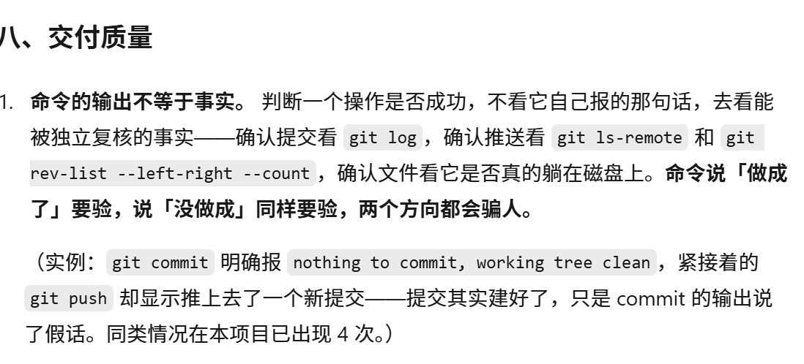
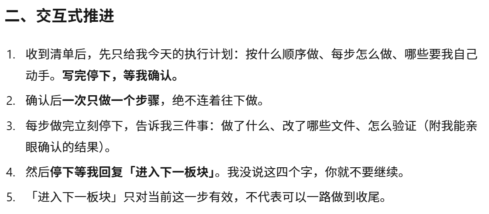
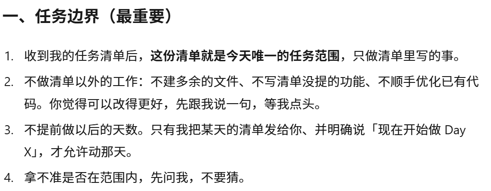

# Day 6 打卡日志 · 项目规则

| | |
| --- | --- |
| **日期** | 2026-09-24 |
| **周次** | 第 1 周 |
| **主题** | 项目规则（检查并完善 `AGENTS.md`） |
| **状态** | ✅ 全部完成 |
| **当日提交** | `e65f984`（5 文件，+363） |

---

## 一、今日板块

- [x] **① 检查 Day 1 的规则文件** —— 核对位置、完整性，并发现一个隐藏问题
- [x] **② 追加自己的规则** —— 在 `AGENTS.md` 末尾新增第八节「交付质量」
- [x] **③ 让 AI 复述确认** —— AI 逐节复述 + 自陈三条最容易违反的地方

**五步工作流小结**（今天走完第 ④ 步）：

| 步 | 干什么 | 产出 | 进度 |
| --- | --- | --- | --- |
| ① 研究需求 | 搞清楚给谁用、解决什么真问题、值不值得做 | `research.md` | Day 3 ✅ |
| ② 写 PRD | 把模糊需求翻译成精确规格 | `PRD.md` | Day 4 ✅ |
| ③ 技术设计 | 用什么技术、数据存哪、怎么跑起来 | `TECH_DESIGN.md` | Day 5 ✅ |
| ④ 保存项目规则 | 把 AI 必须守的规矩写成文件固化 | `AGENTS.md` | **今天完善**（Day 1 初建、Day 6 追加） |
| ⑤ 小步开发和迭代 | 一次只做一小块，跑通再往下 | 能跑的代码 | Day 7 起 |

**今天要掌握的一句话**：**你给自己项目加了哪条新规则？它防的是哪种情况？**

> 加的是「**命令的输出不等于事实**」。防的是：把命令的**自我汇报**当成结论——尤其是命令说「没做成」但其实做成了的时候，信了它就重做一遍，白白产生重复提交。

---

## 二、主任务

- [x] 检查 `AGENTS.md`：位置、完整性、Day 1 的规则是否都还在
- [x] 追加至少 1 条自己的规则（只允许追加，不重写）
- [x] 让 AI 复述规则内容，确认它理解得对

### 检查发现的隐藏问题：规则文件一直不在仓库里

| 位置 | 检查前 | 检查后 |
| --- | --- | --- |
| 工作区根 `my-project/AGENTS.md` | ✅ 在（52 行） | ✅ 在（同步副本） |
| Git 仓库 `The sea of reading/` | ❌ **没有** | ✅ 在（58 行，权威版） |

**问题在哪**：Day 1 建规则文件时放在了**工作区根**，而 Git 仓库是工作区下的**子目录**，两者不是同一个地方。后果是——`git ls-files` 里查不到它，**GitHub 上翻这个仓库看不到任何规则文件**，队友 clone 下来也拿不到规则。而清单的完成标准写的是「AGENTS.md 在**项目里**」。

**修法**：把规则文件复制进仓库，并定下双份的分工——

| 哪一份 | 角色 | 为什么需要它 |
| --- | --- | --- |
| 仓库版 `The sea of reading/AGENTS.md` | **权威版** | 入库、可打卡、队友可见 |
| 工作区根 `my-project/AGENTS.md` | **副本** | AI 工具自动读的是这一份，行为约束靠它 |

**同步机制**：改仓库版 → 覆盖工作区根 → `cmp` 验证两份一致。不用靠记忆，是一个固定动作。

> 两份文件的 MD5 已核到一致：`b03aa761a840ffff1c725042b1b5ac65`。

### 追加的规则（第八节，全文）

```markdown
## 八、交付质量

1. **命令的输出不等于事实。** 判断一个操作是否成功，不看它自己报的那句话，
   去看能被独立复核的事实——确认提交看 `git log`，确认推送看 `git ls-remote`
   和 `git rev-list --left-right --count`，确认文件看它是否真的躺在磁盘上。
   **命令说「做成了」要验，说「没做成」同样要验，两个方向都会骗人。**

   （实例：`git commit` 明确报 `nothing to commit, working tree clean`，
   紧接着的 `git push` 却显示推上去了一个新提交——提交其实建好了，
   只是 commit 的输出说了假话。同类情况在本项目已出现 4 次。）
```

**为什么挑这一条**（当时从 6 个候选里选的）：

| 候选规则 | 防什么 | 本项目踩过几次 |
| --- | --- | --- |
| **命令输出 ≠ 事实**（选定） | 把「其实做成了」误判成失败 → 重复提交 | **4 次** |
| 引用数字须在最后一次改动后重测 | 记录与事实不符 | 1 次（Day 4） |
| 引用截图前先确认文件存在 | 仓库留裂图 | 1 次（Day 5） |
| 新建目录前跑 `git check-ignore` | 文件被忽略规则吞掉 | 1 次（Day 2） |
| 截图要求同屏含 A+B 时先量距离 | 交不出合规截图 | 1 次（Day 5） |
| AGENTS.md 两处同步 | 规则分叉 | 今天刚出现 |

踩得最多、后果最隐蔽、也最通用（换个项目照样成立）——所以选它。

### 复述确认：AI 说了什么

AI 逐节复述了前七节的要求，然后重点复述第八节，拆成三层：

| 层 | 内容 |
| --- | --- |
| 为什么不能信 | 命令的输出是它「说」的，不是它「做」的 |
| 换成什么去验 | 提交看 `git log`；推送看 `git ls-remote` + `git rev-list --left-right --count`；文件看磁盘上有没有 |
| 两个方向都要验 | 不只「它说成功时」要验，**它说失败时也要验** |

**关键的是它自己交代的三条薄弱环节**（这部分才是复述真正的价值）：

1. **容易「顺手优化」** —— 看到口径不一致、命名不统一就想顺手改
2. **容易在同一轮回复里多做半步** —— 顺手把下一步的准备工作也做了
3. **从「命令输出」跳到「结论」太快** —— 中间那一步「去查事实」是慢的，它天然想省掉

> 这三条已被要求「严禁再犯」，并写进了长期备忘。

---

## 三、完成标准

- [x] `AGENTS.md` 在项目里 —— 仓库版 `The sea of reading/AGENTS.md`，**58 行 / 4669 字节**
- [x] Day 1 写入的规则仍在 —— 七节（一 ~ 七）完好，位置一行没挪
- [x] 重点核对的「当天只做当天任务」那条仍在 —— **由五条组合表达**，逐条核过（见下方说明）
- [x] 追加了至少 1 条自己的规则 —— 第八节「交付质量」
- [x] AI 能复述出规则内容 —— 见第二节末，附自陈的三条薄弱环节

**关于「当天只做当天任务」这条的说明**：文件里**没有**字面这七个字，该意思由以下五条**组合表达**，截图打卡时需一起框住：

| 位置 | 原文 |
| --- | --- |
| 一、1 | 这份清单就是今天唯一的任务范围 |
| 一、3 | 不提前做以后的天数 |
| 二、2 | 一次只做一个步骤，绝不连着往下做 |
| 二、4 | 停下等我回复「进入下一板块」 |
| 二、5 | 「进入下一板块」只对当前这一步有效 |

复核方式：对这五条关键词做计数，结果 = **5**，一条没少。

---

## 四、今日交付物

- [x] **`AGENTS.md` 追加第八节** —— 本日主产出
- [x] **截图** —— 三张已归档（第八节 + 第二节 + 第一节），见下方
- [x] **改动文件清单 + 归属任务** —— 见第五节
- [x] **提交并推送** —— `e65f984`（5 文件，+363）

### 截图：打开的 `AGENTS.md`







完成标准要求截图里**同时**看到两处：① 新追加的第八节 ② 原有的「当天只做当天任务」那几条。两处分别在第 54–58 行与第 5–18 行，隔 30 多行、一屏装不下，故**分三张接力覆盖**（与 Day 4 用四张覆盖 AC-1~AC-23 是同一做法）。

| 图 | 覆盖 | 对应完成标准的哪一半 |
| --- | --- | --- |
| `Day-06-AGENTS-1.png` | **八、交付质量**（第 54–58 行，完整） | **新追加的规则** ✅ |
| `Day-06-AGENTS-2.png` | **二、交互式推进**（第 12–18 行，五条全） | 「没说『进入下一板块』就不越界」✅ |
| `Day-06-AGENTS-3.png` | **一、任务边界（最重要）**（第 5–10 行，四条全） | 「**当天只做当天任务**」✅ |

**三张合起来，完成标准里的两个要素都有证据**：

- 「**当天只做当天任务**」→ 一.1「这份清单就是今天唯一的任务范围」+ 一.3「不提前做以后的天数」→ **第 3 张**
- 「没说『进入下一板块』就不越界」→ 二.2 / 二.4 / 二.5 → **第 2 张**

> **补图这件事本身值得记一笔**：最初交的是第 1、2 张，核对时发现**第 2 张从第二节才开始拍，第一节整节跳过去了** —— 而「只做当天任务」恰恰写在标题标着「最重要」的那一节里。补了第 3 张，链条才闭合。**截图要对着文件核内容，不只是数张数。**

---

## 五、改动文件清单与归属

| 文件 | 变动 | 归属任务 |
| --- | --- | --- |
| `The sea of reading/AGENTS.md` | 新增进仓库 + 追加第八节（52 → 58 行） | **Day 6** 主任务 |
| `journal/Day-06.md` | 新增 | **Day 6** 打卡日志 |
| `journal/assets/Day-06-AGENTS-1.png` | 新增（125 KB）—— 八、交付质量 | **Day 6** 交付物 |
| `journal/assets/Day-06-AGENTS-2.png` | 新增（117 KB）—— 二、交互式推进 | **Day 6** 交付物 |
| `journal/assets/Day-06-AGENTS-3.png` | 新增（103 KB）—— 一、任务边界（最重要） | **Day 6** 交付物 |
| `my-project/AGENTS.md`（工作区根） | 同步副本 | **Day 6**，不在仓库内，不参与提交 |
| 其余全部文件 | 本次未改动 | —— |
| `docs/PRD.md` | 本次未改动 | Day 4 |
| `docs/TECH_DESIGN.md` / `docs/data-flow.svg` | 本次未改动 | Day 5 |

> 今天严格没碰 PRD 和技术设计（清单写着「今日不做：重写整个规则文件；写代码」）。技术设计里定下的四个代码文件（`index.html` / `styles.css` / `store.js` / `app.js`）**今天一个都没建**，那是 Day 7 的事。

> **本日分两次提交**：主体提交 `e65f984`（5 文件，+363）交付全部产出；随后一次回填提交把提交号写进本日志（因为日志在提交之前定稿，提交号当时还不存在）。这是本项目 Day 3（`f78fda7`）、Day 4（`c1f7f69`）、Day 5（`3f7d70b`）以来的一贯做法。

---

## 六、今日思考题：规则是写给谁的

今天要回答的是「你给自己项目加了哪条新规则？它防的是哪种情况？」——但更值得想的是：**这份文件和前面五天的产出，性质完全不同。**

| | `PRD.md` / `TECH_DESIGN.md` | `AGENTS.md` |
| --- | --- | --- |
| 写给谁看 | 人（我、以后的队友） | **AI**（协作的执行方） |
| 回答什么 | 做什么、用什么做 | **怎么和我配合** |
| 违反了会怎样 | 做错功能 | 越界、多做、乱改 |
| 怎么验收 | 对照验收标准 | **让 AI 复述一遍** |

### 为什么「复述」是这类文件唯一的验收方式

规则文件不是靠「写下来」生效的，是靠**读它的一方理解正确**才生效的。所以今天第三步的复述很关键——如果 AI 把「一次只做一个步骤」理解成「一次可以做一个模块」，那规则写得再漂亮也等于没写。

**而且光复述不够。** 今天的复述里最有价值的不是「它背对了七节」——那是复述的下限。有价值的是它自己交代了**最容易违反的三条**，等于给了我一把可以量它的尺子。**一份规则的可信度，取决于违反时能不能被发现。**

### 「防的是哪种情况」为什么比「规则是什么」更重要

因为规则的表述可以背，但它**什么时候触发**背不了。

以今天这条为例：如果只记「要核对事实」，遇到事情时根本想不起来要用；但如果记得「**命令说没做成的时候也要去验**」，触发的场景就清清楚楚——一听到「没成功」三个字，就知道该去查 `git log`。

> **好的规则描述的不是动作，是场景。** 你以后自己定规则时，可以拿这一条当标准问自己：我能不能说出它具体在哪个时刻生效？

### 一句话版本

> 规则文件是给执行者看的说明书，它的质量不取决于写得多全，取决于**执行者能不能准确复述，以及违反了能不能被抓住**。

---

## 七、今日卡点与解法

今天技术上没有卡点（没有代码、没有环境问题），但有**两个值得记的东西**。

### 卡点一：一个「一直以为没问题」的隐患

Day 1 建好规则文件之后，五天里没人再看过它的位置。直到今天清单要求「检查规则文件」，才发现在 **GitHub 仓库里根本没有这份文件**。

**为什么值得记**：

- 它不是「做错了」，是**当时看是对的**——规则文件确实建好了，AI 也确实在遵守它（因为工具读的是工作区根那份）
- 但它和清单要求的「AGENTS.md 在**项目里**」有偏差，而这个偏差**只有专门去查才会暴露**
- 这和 Day 5 发现的「双击打开的假设没人验证过」是同一类问题：**不是写错了，是有一个没被检查过的假设**

> **教训：交付物要放在「验收时会被看到的地方」。** 一个文件放在哪，和它存不存在，是两件事。

### 卡点二：靠自觉还是靠机制

AI 在复述时自己交代了一件事，我认为值得记下来：

> 「看到口径不一致就想顺手改——Day 5 键名、Day 6 两份 AGENTS.md，这两次我都先问了你才动。**但这是靠自觉，不是靠机制。**」

这句话点出了一个真问题：**规则写在文件里，只能约束「有意违反」，约束不了「无意疏忽」。**

今天追加的第八节为什么比前七节更「硬」？因为前七节多是我主观判断（"这个算不算顺手优化"），而第八节**有客观判据**：命令说成功、事实是失败，这个矛盾一验就现形，没有解释空间。

> **能验的规则才拦得住人。** 这是今天追加这条规则时，除了「踩得最多」之外的第二个理由。

---

## 八、余力加练：把规则改写成队友也能用的检查项

**任务**：把其中一条规则改写成队友也能用的检查项。

**为什么挑今天新加这条**：它**不依赖任何项目背景**——不知道这个项目是干什么的、不认识我，也能照着执行。而像「不顺手优化」那类规则，换个项目、换个人，含义就变了，没法直接搬。

### 改写前（规则式）

> 命令的输出不等于事实。判断一个操作是否成功，不看它自己报的那句话，去看能被独立复核的事实……

**队友读完的问题**：他知道「不该信命令」了，但**不知道该怎么做** —— 什么时候用？做哪几步？什么算通过？规则告诉他态度，没告诉他动作。

### 改写后（检查项式）

> **检查项：汇报「已完成」之前的事实核查**
>
> **什么时候用**：每次执行完 `git commit` / `git push` 这类会留下痕迹的操作，准备向别人说「已完成」之前。
>
> **耗时**：三条命令，一分钟以内。

| 步 | 命令 | 通过判据 | 漏了会怎样 |
| --- | --- | --- | --- |
| ① 提交建好了吗 | `git log --oneline -3` | 最近一条就是你要的那条 | 以为提交了，工作区其实还是脏的 |
| ② 推上去了吗 | `git ls-remote origin main` | 返回值与 `git rev-parse HEAD` **逐字符一致** | 以为推了，其实只在本地 |
| ③ 有漏推的吗 | `git rev-list --left-right --count main...origin/main` | 输出 `0  0` | 前两步都过了，但历史里还压着没推的提交 |

**最容易被漏掉的一条**：

> **命令报「没成功」的时候，也要走这三步。**

失败信息同样可能是假的。实例：`git commit` 报 `nothing to commit, working tree clean`，紧接着 `git push` 却把新提交推上去了——说明提交其实建好了。**信了 commit 那句话去重做，就会产生重复提交。**

**不要拿它当唯一依据**：`git status` 里那句 `Your branch is ahead of 'origin/main' by N commit` —— 它基于**本地缓存**的远端状态，没 `fetch` 过就可能过期。它不是错，是不够硬。

### 这次改写暴露的三件事

1. **「规则」和「检查项」是两种东西。** 规则说**态度**（不要轻信命令输出），检查项说**动作**（敲哪三条命令、什么算通过）。**能给队友用的只有后者**——因为前者要靠理解，后者只要照做。
2. **能跨项目复用的规则，约束的是「工具与事实的关系」，不是业务。** 这条能搬，是因为它讲的是「命令输出可能是假的」——这跟用什么语言、什么框架无关。而业务规则（比如「删书要级联删笔记」）搬不走。
3. **写检查项时被迫补了「漏了会怎样」这一列** —— 写规则时不需要。但这一列恰恰是队友愿意照做的原因：它回答的不是「为什么」，是「不做会出什么事」。

> **一句话**：规则是给自己写的，检查项是给别人写的。**看一份规则能不能给队友用，标准很简单——他能不能不看你的解释就照着做完。**

---

## 九、今日学到的

- **规则文件是给执行者看的说明书，验收方式是让它复述。** PRD 写给人看，AGENTS.md 写给 AI 看——后者必须验证「它真的理解了」，因为规则不是写下来就生效的
- **好的规则描述的不是动作，是场景。** 「要核对事实」记不住，「命令说没做成的时候也要去验」才记得住——前者是动作，后者是触发时机
- **能验的规则才拦得住人。** 主观判断型的规则（"算不算顺手优化"）有解释空间；客观判据型的（"命令说成功、事实是失败"）没有
- **交付物要放在验收时会被看到的地方。** 文件建在工作区根，但仓库在子目录里——结果 GitHub 上根本看不到它，而这件事五天里没人发现
- **靠自觉和靠机制是两回事。** 一件事连续两次做对（先问再改），如果靠的是自觉而不是流程，那它随时可能失效
- **同一个隐患会以不同面孔出现。** Day 5 是「双击打开没人验证过」，Day 6 是「规则文件在不在仓库里」——都是**一个从没被检查过的假设**。清单让做「检查」，查的就是这个

---

## 十、明日待办

- [x] ~~补 Day 6 截图~~ —— 三张已归档（2026-09-24）
- [ ] 开始 Day 7（待清单）—— 按技术设计，第一步是**实测 localStorage 在双击打开时能不能用**
- [x] ~~余力加练：把其中一条规则改写成队友也能用的检查项~~ —— 见第八节

---

*本日志由 AI 协助整理，内容基于当日实际操作记录。*
