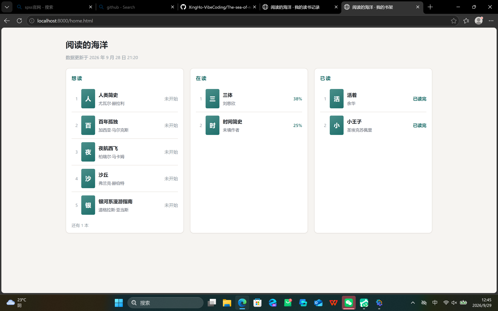

# Day 8 打卡日志 · 用假数据渲染项目主视图

| | |
| --- | --- |
| **日期** | 2026-09-29 |
| **周次** | 第 2 周 |
| **主题** | 四种页面状态：加载中 / 空 / 错误 / 成功 |
| **状态** | ✅ 全部完成（截图已于 Day 9 补交） |
| **当日提交** | `09d7b28` |

---

## 一、今日板块

- [x] **① 一句话生成页面** —— 先把「热搜首页」那个示例提示词，改写成符合本项目的版本
- [x] **② 本地运行** —— 起本地服务，浏览器里打开，打卡截图要地址栏里的 localhost
- [x] **③ mock 数据渲染** —— 用本地假数据渲染三栏看板，四种状态逐个验收

**今天要掌握的一句话**：**四种页面状态里，你觉得哪种最容易被忽略？为什么？**

（我的回答：**「空」和「错误」最容易被忽略**——因为开发时数据永远是有几条的，路永远走得通，这两种状态不主动去造、去逼，就永远看不见。加载中至少每次刷新都会闪一下；空和错误却要**故意把数据清空、故意让取数失败**才会出现。而这恰好是本页的重点：一个"看起来能用"的页面，和"坏了也不白屏"的页面，差别全在这两条看不见的路上。）

---

## 二、主任务：mock 数据版主视图

Day 8 的主任务，和 Day 7 的书单页**不是一回事**：

- Day 7 的 `index.html` 是「**操作页**」——加书、改状态、记笔记
- Day 8 的 `home.html` 是「**看板页**」——一眼看清「我的书都到什么程度了」，只读、不操作

所以这次是**新建三个独立文件**，Day 7 的成果一个字没动：

| 文件 | 规模 | 分工 |
| --- | --- | --- |
| `home.html` | 76 行 | 顶部 + 三栏骨架 + 四个状态容器 |
| `home.css` | 212 行 | 沿用项目原有配色；桌面三栏、≤480px 堆叠 |
| `home.js` | 413 行 | 假数据 10 本 + `fetchBooks()` 唯一取数入口 + 四态 + 渲染 |

**页面结构**（提示词第二节逐条落地）：

- 顶部：「阅读的海洋」+「数据更新于 …」（取数据里最新的一次 `updatedAt`）
- 三栏 = 三种阅读状态：想读 / 在读 / 已读（**三栏本身就是分类，不再加筛选按钮**）
- 每条一本书：序号（每栏各自从 1 开始）+ 书名 + 作者（没填显示「未填作者」）+ 右侧进度（在读→`38%`、已读→`已读完`、想读→`未开始`）
- 每栏最多 5 条，超出显示「还有 N 本」；某栏为空显示一行字，不留空白
- 封面：有 `coverUrl` 显示小图；没有 → 书名第一个字的占位块

**四种状态**（本页重点）：

| 状态 | 触发 | 显示 |
| --- | --- | --- |
| 加载中 | 数据没到 | 「正在读取你的书架…」（人为延迟 0.8 秒） |
| 成功 | 正常拿到 | 三栏 |
| 空 | 一本都没有 | 「书架还是空的」+ 引导 |
| 错误 | 取数失败 | 可读的错误提示 + 「重试」按钮 |

---

## 三、完成标准对照

| 清单要求 | 状态 | 证据 |
| --- | --- | --- |
| 页面本地能打开 | ✅ | `localhost:8000` 下 8 个地址全 200 |
| 列表和卡片用本地假数据渲染 | ✅ | 三栏 + 10 本假数据，四态全过 |
| 改动已提交 | ✅ | `Day 8｜…`（回填） |
| 截图 | ✅ | `Day-08-mock-home.png`（Day 9 补交，见下方） |

### 截图：mock 数据主视图

> 注：图摄于 Day 9（2026-09-29）样式修复**之前**——当时页面与 Day 8 收工时完全一致（这张图本是为 Day 9 审查留的「修复前」证据），特此注明。

---

## 四、验证结果

**① 静态自检（6 项）**：语法 OK · `home.js` 要的 16 个 id 全对得上 · 零外部地址 · 无 import/export · 假数据 10 本（6 想读 / 2 在读 / 2 已读）· 文件规模

**② 自动化（40 项断言，0 失败）**：四态切换、「还有 1 本」是 1 不是别的数、序号每栏重开、栏内按 `updatedAt` 倒序、`120÷320=38%` 和 `65÷260=25%` 对得上手算、未填作者兜底、首字占位、点「重试」重走一遍加载。

**③ 亲手验收（四种状态逐个看）**：加载中、成功是每次刷新自然看到的；「空」和「错误」由 AI 临时改取数行拨出来，我 `Ctrl+F5` 亲眼看完后还原——还原靠备份 + 指纹核对，证明一个字没变。

---

## 五、改动文件清单与归属

| 文件 | 变动 | 归属任务 |
| --- | --- | --- |
| `home.html` | **新增**，76 行 | **Day 8** 主产出 |
| `home.css` | **新增**，212 行 | **Day 8** 主产出 |
| `home.js` | **新增**，413 行 | **Day 8** 主产出 |
| `docs/day8-prompt.md` | **新增** | **Day 8** 提示词（五段结构） |
| `journal/Day-08.md` | **新增** | **Day 8** 打卡日志 |
| `journal/assets/Day-08-mock-home.png` | **新增**（Day 9 补交） | **Day 8** 交付物 |

---

## 六、今日卡点与解法

1. **后台服务活不过会话** —— `python -m http.server` 在会话结束就被回收，第二天一打开就「拒绝连接」。这是已知常态，重起即可。
2. **AI 报错一个数字**：AI 说「数据更新于 9 月 28 日 13:20」，页面实际是 **21:20**。原因是假数据里 `updatedAt` 带 `Z`（世界时），页面按本地时区（+8）渲染。**页面是对的，AI 读的是文件里的字面量**。教训：报「页面上显示什么」之前，得走完「存的值 → 渲染后的值」这一步。

---

## 七、今日学到的

- **空状态和错误状态，不主动造就永远看不见** —— 这也是「今天要掌握」那一问的答案
- **「存的 ≠ 显示的」**：带 `Z` 的时间戳、`null` 的兜底文案、算出来的百分比，都别拿数据源里的字面量当页面上的最终值
- **看板页和操作页要分开** —— 一个「用来看」、一个「用来改」，混在一起两头都做不好

---

## 八、明日待办

- [x] 补两张打卡截图（Day-07 / Day-08，已于 Day 9 补交）
- [ ] 余力加练：可复用卡片/列表组件（今天清单里提了，**没做**）

---

*本日志由 AI 协助整理，内容基于当日实际操作记录。*
