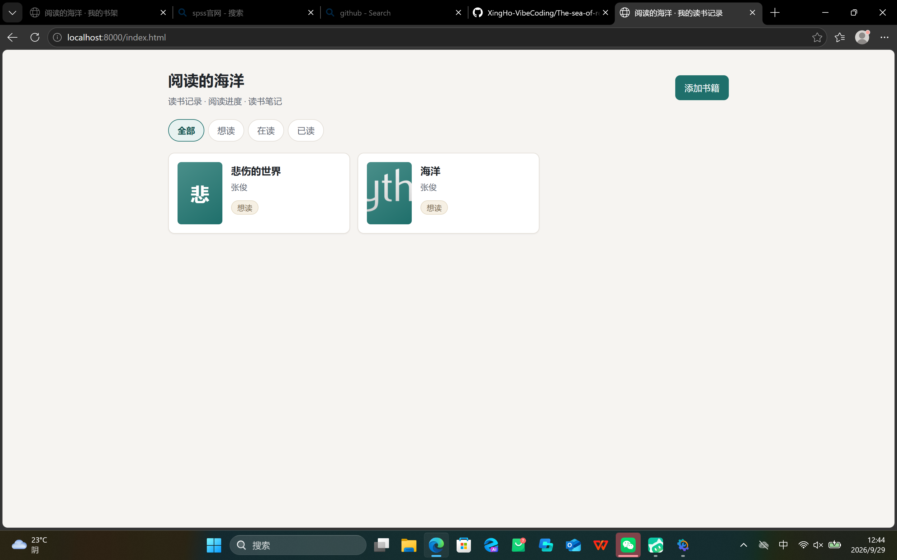
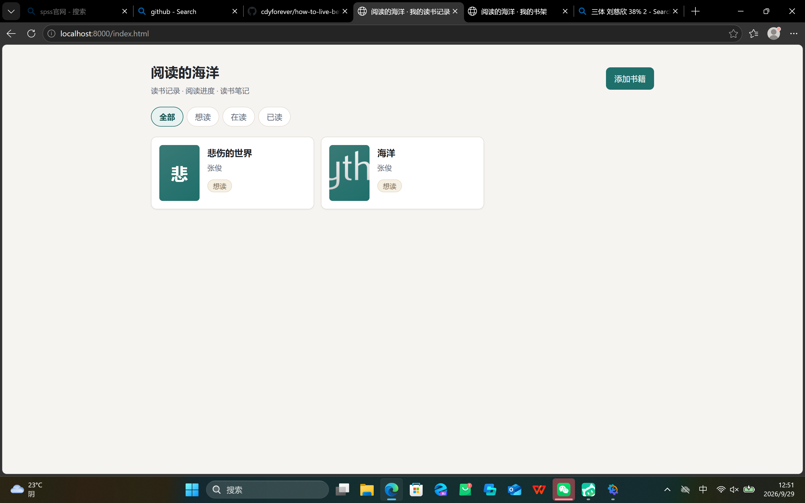
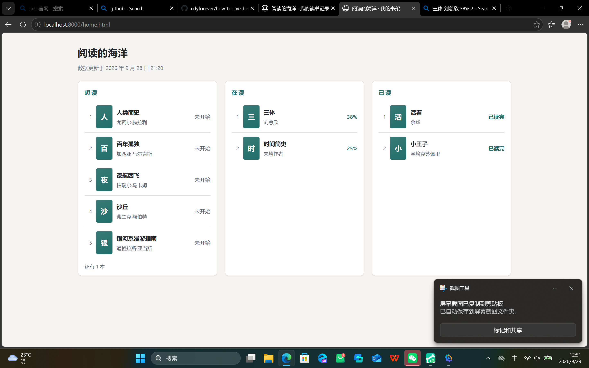

# Day 9 ｜ 用设计规则做一次前端审查和修复

> **日期**：2026-09-29（周二）
> **主题**：能用的产品和「看起来正经」的产品，差的是这些细节
> **当日提交**：`87ad3be`（另有补交 Day 7/8 截图的 `1d90fca`）

---

## 一、今日板块

| 板块 | 做了什么 | 状态 |
|---|---|---|
| ① 了解设计规则 | 定下 6 条硬规则（见第二节），审查全按它来 | ✅ |
| ② 用规则做前端审查 | 两个页面逐条对照，对比度用公式算出实际数值，列出 5 个问题 | ✅ |
| ③ 修复 | 5 处全修，只动两个 CSS 文件，功能回归 199 项断言全过 | ✅ |

## 二、依据的设计规则（板块① 的产出）

| 类别 | 规则 | 过线标准 |
|---|---|---|
| 文字对比 | WCAG AA | 正文与背景 ≥ 4.5:1，大字 ≥ 3:1 |
| 字体层级 | 标题 > 栏标题 > 书名 > 说明，逐级递减 | 不同级打架 |
| 间距 | 8 的倍数（8/16/24…） | 无 5px、13.5px 这类碎数 |
| 对齐 | 卡片内元素共用对齐基线 | 目测一条线 |
| 按钮状态 | 至少有 hover（悬停）和键盘焦点两种 | CSS 里有对应规则 |
| 移动端 | 窄屏不横向溢出，断点全站统一 | 两个页面同一断点 |

> 说明：对比度不是「看着还行」，是拿前景/背景色值代入 WCAG 相对亮度公式**算出来**的数。

## 三、审查结果（板块② 的产出）

**审出 5 个问题**（位置 / 违反哪条 / 证据）：

| # | 问题 | 位置 | 证据 |
|---|---|---|---|
| 1 | 按钮没有键盘焦点样式 | styles.css 里全部 `.btn` / `.filter` | 只有 `:hover`，没有 `:focus-visible`（home.css 的重试按钮反而有） |
| 2 | 弱文字对比不达标 | `--ink-faint: #8b95a1` | 纸底 **2.77**、卡片白 **3.04**，都低于 4.5 |
| 3 | 封面首字与渐变浅端对比不足 | 渐变浅端 `#4a8f8a` | 白字对比 **3.76**（≥3 但 <4.5） |
| 4 | 字号/间距出现碎数 | styles.css 多处 | `13.5px`、`12.5px`、`5px` |
| 5 | 移动端断点不统一 | home.css 480px vs styles.css 560px | 同一产品两套断点 |

**查了没问题的 2 条**（如实记录，没有硬凑）：字体层级 ✅、对齐 ✅。

## 四、修复明细（板块③，5/5 全修）

| # | 修复 | 之前 | 之后 | 涉及文件 |
|---|---|---|---|---|
| 1 | 补键盘焦点样式 | 无 | `.btn:focus-visible, .filter:focus-visible`（墨绿描边） | styles.css |
| 2 | 弱文字加深 | `#8b95a1`（2.77 / 3.04） | `#5f6a76`（**5.02 / 5.51**） | styles.css + home.css |
| 3 | 渐变浅端加深 | `#4a8f8a`（白字 3.76） | `#3a7a76`（**4.97**） | styles.css + home.css |
| 4 | 清碎数 | 13.5 / 12.5 / 13.5px、5px | 13 / 12 / 13px、6px | styles.css |
| 5 | 断点统一 | 一页 480、一页 560 | 都 560px | home.css |

**功能没被改坏的证据**：修完复跑三个回归脚本，40 + 78 + 81 = **199 项断言全过，0 失败**；两个 CSS 大括号配平（85/85、33/33）。

### 修前后截图（同位置对比）

修复前（当日 12:44 / 12:45 摄）：

修复后（当日 12:51 摄，Ctrl+F5 强刷后）：

对比点：书单页 `悲` 字封面的底色明显变深；看板页「数据更新于…」一行和序号明显更清楚。

## 五、完成标准逐条对照

| 完成标准 | 状态 | 证据 |
|---|---|---|
| 至少修掉 3 处设计问题 | ✅ 修了 5 处 | 第三节问题表 → 第四节修复表 |
| 修前后截图各一张 | ✅ 两页共 4 张 | 上面的四张图 |
| 今日不做：大改版面结构 / 新增页面 | ✅ 守住了 | `git diff` 只有两个 CSS 文件，HTML/JS 一行没动 |

## 六、改动文件清单与归属

| 文件 | 归属 |
|---|---|
| styles.css（改，266 → 275 行 / 10101 → 10498 字节） | Day 7 建 → **Day 9 修** |
| home.css（改，212 行不变、3 处改值 / 5552 字节） | Day 8 建 → **Day 9 修** |
| journal/Day-09.md（新，本文件） | **Day 9** |
| journal/assets/Day-09-before-index.png（新） | **Day 9** |
| journal/assets/Day-09-before-home.png（新） | **Day 9** |
| journal/assets/Day-09-after-index.png（新） | **Day 9** |
| journal/assets/Day-09-after-home.png（新） | **Day 9** |

> 另：本日还补交了 Day 7 / Day 8 欠的两张打卡截图（`Day-07-mvp-home.png`、`Day-08-mock-home.png`，取自本日「修复前」留证），并把两篇日志的「待补」占位换成真实引用——见提交 `1d90fca`。

## 七、今日思考（每日一问）

> **今天改的几处里，哪一处对「像不像一个正经产品」影响最大？**

我的答案：**弱文字对比度那条（`#8b95a1` → `#5f6a76`）**。

理由：焦点样式只有用键盘的人才看得到，碎数字号几乎没人注意，断点统一只在特定窗口宽度才显形——但弱灰文字**每一页、每一眼都在**。「数据更新于…」、序号、笔记时间，这些字原来糊成一片，是「随手做的页面」的味道；拉到标准线以上，整页立刻精神了。正经产品的感觉往往不在大结构，在这些「次要文字」上。

（这一条是我的观察。你自己怎么排序，补在这里：________）

## 八、今日卡点与解法

**选色一次没选准**：第一版把 `--ink-faint` 定成 `#6b7683`，一算纸底对比只有 **4.21**，不到 4.5；加深一档到 `#5f6a76`，复算 **5.02 / 5.51**，达标。

教训：**颜色合格与否要算，不能看**。「看」是差不多，「算」才是过/不过。

## 九、今日学到的

1. WCAG 对比度有公式（相对亮度）：4.5:1 是正文线，3:1 是大字线
2. `:focus-visible` 只在键盘导航时显示焦点、不干扰鼠标点击——补焦点态用它最合适
3. 8 点间距体系：间距/字号取 8 的倍数（或其一半），碎数是非高清屏上发虚的来源
4. 断点是全站约定，不是单页私事——两个页面各定一个，迟早行为打架
5. 修样式前先跑回归、修完再跑——199 项断言是「功能没被改坏」的安全网
6. 审查要出数字证据：对比度算出来、diff 列出来，比「我觉得变好看了」可信

## 十、明日待办

- [ ] 余力加练（今天没做，如实记）：把一条视觉规则写成可复用组件约束
- [ ] Day 10 按清单推进
