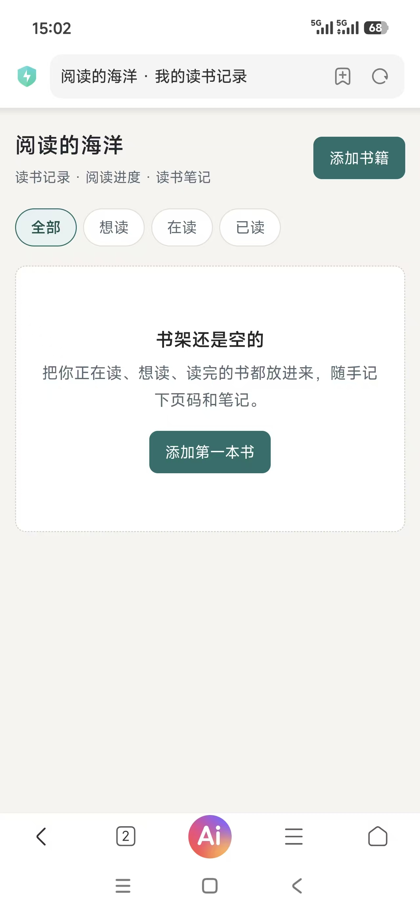
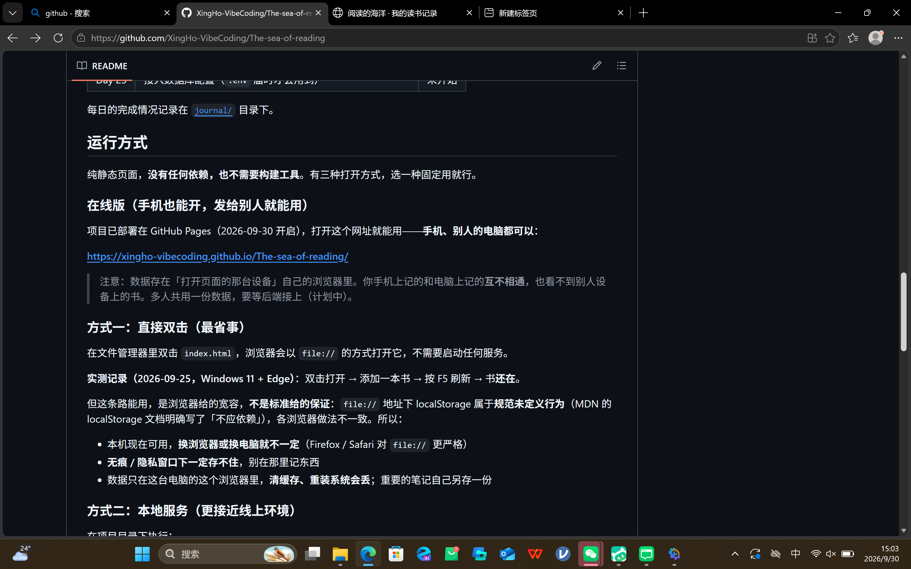

# Day 10 ｜ 部署 GitHub Pages，把「只能自己开」变成「谁都能开」

> **日期**：2026-09-30（周三）
> **主题**：说清问题本身就是解决方案的一半
> **当日提交**：`0805967`（README 修复与部署说明；日志与截图另立一笔，提交号待回填）

---

## 一、今日板块

| 板块 | 做了什么 | 状态 |
|---|---|---|
| ① 截图定位 | 发现 GitHub 上 README「本地运行」方式二的 `localhost:8000` 链接点了打不开，手机上也搜不到 | ✅ |
| ② 自然语言描述问题 | 一句话说清「哪个链接 + 什么现象 + 谁也复现不了」，AI 一次听懂 | ✅ |
| ③ 验证 | 电脑浏览器、手机、curl 三路实测，在线网址全部可开 | ✅ |
| 升级任务 | 原计划只修文档描述，中途升级为「部署 GitHub Pages 上线」 | ✅（计划外新增，当日记入） |

## 二、问题是怎么定位的（板块①②）

我的原话只有一句：**「第二个方式中的那个链接并不能打开，而且我在手机上搜索也无法打开」**。

这句话里有三个关键信息：① 位置（哪个链接）② 现象（点不开）③ 范围（手机也不行）。AI 拿到就能直接定性——

**原因一句话**：`localhost` 的意思是「本机」。这个地址写在 README 里，每个人点开时指向的都是**他自己那台设备**。我电脑上跑着本地服务所以打得开，别人的电脑、我的手机上什么都没跑，必然打不开。这是**文档写法问题**，不是网站坏了。

> 旁证：9-25 当天我截过图，`localhost:8000` 在自己电脑上是正常打开的（当时还加了测试书）——所以「链接是好的，只是它只属于我这台电脑」。

## 三、需求升级与方案

我接着说了句更关键的：**「我希望别人也可以用这个网页，我自己手机上也能打开」**。

这不是「改文档」的需求，是「上线」的需求。AI 给的方案：**GitHub Pages**（免费托管静态页面），并把丑话说在前面——上线后数据仍存各设备自己的 localStorage，手机记的和电脑记的**互不相通**，真共享要等第 23 天接后端。我拍板：先上线。

## 四、部署过程（板块③，我自己动手的部分）

GitHub 网页版：仓库 → Settings → Pages → Branch 选 `main` → Save。

**踩坑两次**：

1. 第一次点了 Save 没反应；
2. 刷新后 Branch 右边下拉框整个消失，左边还是 None——以为保存丢了。

**排查结论**：那个界面要先在 Branch 下拉框里选中 `main`，下拉框和 Save 才生效；没选对时页面根本不会给你存。按严格顺序（选 main → 确认显示 main → 点 Save）操作第三次成功：出现蓝色「source saved」提示 + 「Pages build in progress / currently being built」状态条。几分钟后部署完成。

教训：网页上「点了没反应」有两种——真没存上，和存上了但提示弱。**刷新后看状态条，别连点 Save。**

## 五、README 改动明细（提交 `0805967`，+16 −6）

| # | 改动 | 之前 | 之后 |
|---|---|---|---|
| 1 | 小节标题 | 「本地运行」 | 「运行方式」（正文锚点同步改） |
| 2 | 新增「在线版」小节 | 无 | 可点击的真网址 + 「各设备数据互不相通」说明 |
| 3 | 第 72 行链接 | `<http://localhost:8000>`（可点但必然打不开） | 改成代码格式（不可点）+ 一句「只指向本机，手机/别人访问不了」 |
| 4 | 存储说明 | 两种方式 | 三种（file:// / 本地服务 / 在线版），并说明第三种数据同样各存各的 |

## 六、验证证据（三路实测）

| 验证路 | 时间 | 结果 |
|---|---|---|
| curl 实测 | 部署完成后 | HTTP **200**，标题「阅读的海洋 · 我的读书记录」，页面含「添加书籍」等文案 |
| 我手机 | 15:02 | 在线网址打开成功，页面完整渲染（截图为证）|
| 电脑浏览器 | 15:03 | README「在线版」小节生效，链接可点击（截图为证）|

手机上显示**空书架**——这不是 bug，恰是「数据各存各的」的直接证据：手机是全新环境，没有我电脑上记的书。

### 修复后截图

> 如实记录：**修复前的截图没有存进 assets**（当时的 README 截图留在当日对话里，手机「打不开」的状态本身截不了图）。修后证据两张齐全。

## 七、完成标准逐条对照

| 完成标准 | 状态 | 证据 |
|---|---|---|
| 修复一个真实前端问题 | ✅ | README 4 处改动，提交 `0805967`（今日 14:53 已推送）|
| 修前后截图 | ⚠️ 部分 | 修后 2 张已归档（上节）；修前截图未存，如实标注 |
| 今日不做：一次改一堆 | ✅ 守住了 | 一个提交只动 README 一个文件，+16 −6 |
| 余力加练：AI 给修复前后差异摘要 | ✅ 做了 | 上节改动明细表即差异摘要 |

## 八、改动文件清单与归属

| 文件 | 归属 |
|---|---|
| README.md（改，138 行 / 7311 字节；+16 −6） | Day 1 建 → **Day 10 改** |
| journal/Day-10.md（新，本文件） | **Day 10** |
| journal/assets/Day-10-after-phone.jpg（新） | **Day 10** |
| journal/assets/Day-10-after-readme.png（新） | **Day 10** |

## 九、今日思考（每日一问）

> **为什么这次的描述一次就命中了？**

回看我发的第一句话，其实无意中踩中了描述问题的最优结构：**位置 + 现象 + 范围**。而第二句「我希望别人也可以用这个网页，我自己手机上也能打开」说的是**目标**，不是改法——AI 因此从「改文档」跳到「部署」，方案才对路。要是当时说「帮我把链接删了」，问题就只解决了一半。

说目标，不说方案——这一条最值钱。

（这一条是我的观察。你自己怎么排序，补在这里：________）

## 十、今日学到的

1. `localhost` = 本机：每个人打开它，指向的都是他自己的设备——它出现在公开文档里，对别人必然失效
2. GitHub Pages 免费托管静态页：仓库 Settings → Pages → 选分支 → Save，几分钟出网址
3. 上线 ≠ 共享：localStorage 跟着设备走，每台设备各存各的；真共享需要后端 + 数据库（计划第 23 天）
4. Markdown 里 `<http://…>` 会渲染成可点链接；不想要可点，就用反引号代码格式
5. 描述问题公式：位置 + 现象 + 范围；进阶版：直接说目标

## 十一、明日待办

- [ ] Day 11 按清单推进
- [ ] （可选）手机在线版加一本书，回电脑刷新看看——亲眼看一次「数据各存各的」
